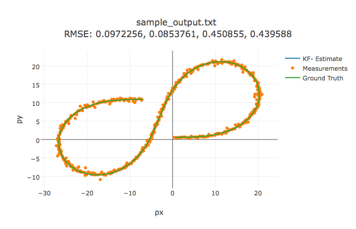
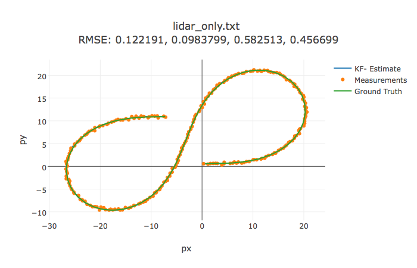
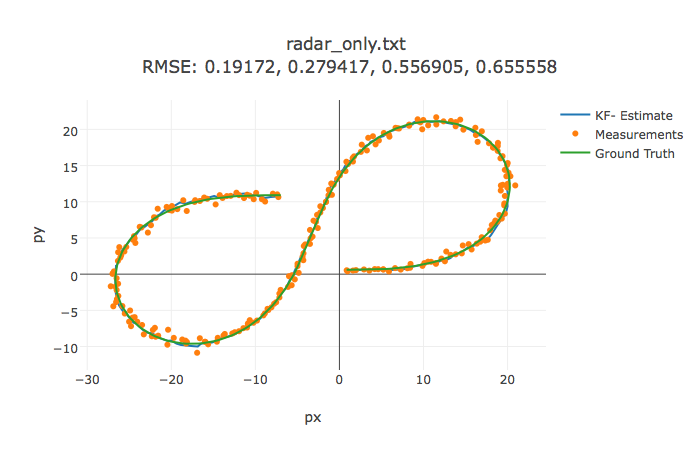
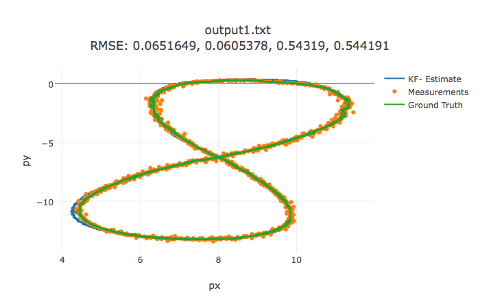

### Extended Kalman Filter to Track a Pedestrian

# Extended Kalman Filter Project Starter Code
This project utilizes a kalman filter to estimate the state of a moving object of interest with noisy lidar and radar measurements. 

This repository includes two files that can be used to set up and intall [uWebSocketIO](https://github.com/uWebSockets/uWebSockets) for either Linux or Mac systems. For windows you can use either Docker, VMware, or even [Windows 10 Bash on Ubuntu](https://www.howtogeek.com/249966/how-to-install-and-use-the-linux-bash-shell-on-windows-10/) to install uWebSocketIO. 

Once the install for uWebSocketIO is complete, the main program can be built and ran by doing the following from the project top directory.

1. mkdir build
2. cd build
3. cmake ..
4. make
5. ./ExtendedKF

Here is the main protcol that main.cpp uses for uWebSocketIO in communicating with the simulator.


INPUT: values provided by the simulator to the c++ program

["sensor_measurement"] => the measurment that the simulator observed (either lidar or radar)


OUTPUT: values provided by the c++ program to the simulator

["estimate_x"] <= kalman filter estimated position x
["estimate_y"] <= kalman filter estimated position y
["rmse_x"]
["rmse_y"]
["rmse_vx"]
["rmse_vy"]

---

## Other Important Dependencies

* cmake >= 3.5
 * All OSes: [click here for installation instructions](https://cmake.org/install/)
* make >= 4.1
  * Linux: make is installed by default on most Linux distros
  * Mac: [install Xcode command line tools to get make](https://developer.apple.com/xcode/features/)
  * Windows: [Click here for installation instructions](http://gnuwin32.sourceforge.net/packages/make.htm)
* gcc/g++ >= 5.4
  * Linux: gcc / g++ is installed by default on most Linux distros
  * Mac: same deal as make - [install Xcode command line tools]((https://developer.apple.com/xcode/features/)
  * Windows: recommend using [MinGW](http://www.mingw.org/)

## Basic Build Instructions

1. Clone this repo.
2. Make a build directory: `mkdir build && cd build`
3. Compile: `cmake .. && make` 
   * On windows, you may need to run: `cmake .. -G "Unix Makefiles" && make`
4. Run it: `./ExtendedKF path/to/input.txt path/to/output.txt`. You can find
   some sample inputs in 'data/'.
    - eg. `./ExtendedKF ../data/obj_pose-laser-radar-synthetic-input.txt`


## Results
The following input files were used to check the performance of the implementation using the RMSE of px,py,vx,vy. The results were visualized with the [following utilities](https://github.com/udacity/CarND-Mercedes-SF-Utilities). The RMSE values are stated below the title of each chart.

### Dataset 1 - ../data/obj_pose-laser-radar-synthetic-input.txt
 



### Dataset 1 - Lidar only - ../data/obj_pose-laser-radar-synthetic-input.txt
 



### Dataset 1 - Radar only - ../data/obj_pose-laser-radar-synthetic-input.txt



### Dataset 1 - ../data/sample-laser-radar-measurement-data-1.txt
 



### Dataset 2 - ../data/sample-laser-radar-measurement-data-3.txt
 


```python

```
